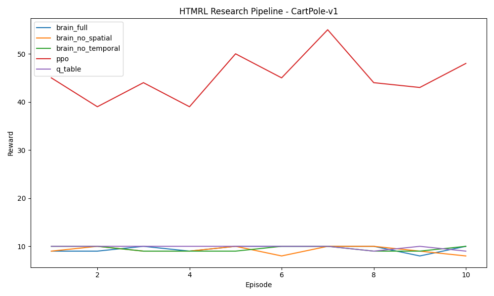

# One-Page Project Summary (Updated from Current Codebase)

## Overview
The sponsor challenged our team to build a reliable way to evaluate whether a Hierarchical Temporal Memory (HTM)-based agent can be used across multiple reinforcement-learning environments and data modalities instead of relying on single-use scripts. The core engineering problem was not just model training, but creating a reproducible end-to-end pipeline that standardizes data ingestion, encoding, environment adaptation, and HTM inference so results can be compared fairly. Key challenges included preserving sparse distributed representation (SDR) quality across different encoder types, integrating Gym-style state/action spaces into HTM-compatible formats, and instrumenting experiments with repeatable reports and plots. In short, the project required software architecture, algorithm integration, and validation infrastructure to transform HTM experimentation into a maintainable engineering workflow.

## Objectives
- Build a modular HTM experimentation platform with clear boundaries between input handling, encoder selection, environment adaptation, and agent/brain logic.
- Implement and validate multiple encoder families (scalar, RDSE, date, category, coordinate, geospatial, fourier, delta) so the sponsor can run controlled representation experiments.
- Benchmark the HTM-based policies against baseline RL approaches (PPO, Q-table where applicable) across multiple environments, and publish reproducible artifacts (JSON reports and comparison plots).

## Approach
- Collected sponsor/customer needs as engineering requirements centered on reproducibility, cross-environment compatibility, and explainable pipeline behavior.
- Reviewed existing HTM and RL workflow constraints in the repository and refactored around layered modules (`input_layer`, `encoder_layer`, `environment`, and `agent_layer`) to separate responsibilities.
- Performed concept generation and selection for encoder strategy by implementing an encoder factory and consistent interfaces so multiple encoding methods could be swapped without rewriting pipeline code.
- Built environment translation logic to map Gym observations/actions into flat HTM inputs using adapter components, enabling one training/evaluation flow for discrete and continuous environments.
- Implemented experiment orchestration scripts to run a matrix of policies (brain variants, PPO, Q-table) and automatically generate reward logs and summary outputs.
- Created architecture and process documentation (UML activity/sequence/class diagrams) to formalize system behavior and support maintainability.
- Generated and analyzed validation artifacts, including reward summaries and environment-specific comparison plots, to assess whether HTM variants met project expectations versus baselines.

## Outcomes
- Delivered a reproducible research pipeline that generates structured outputs (`reports/research_demo/summary.json`, per-run reward JSON files, and comparison plots) so the sponsor can rerun evaluations instead of rebuilding experiments manually.
- Demonstrated cross-environment execution in CartPole-v1, FrozenLake-v1, MountainCar-v0, Pendulum-v1, and LunarLander-v3 with a unified experiment matrix, proving the architecture is portable beyond a single task.
- Produced quantitative comparisons showing that baseline PPO can outperform HTM variants in some settings (e.g., CartPole), while HTM variants remain competitive or stronger in others (e.g., lower-loss behavior than PPO on Pendulum and better average scores than PPO on LunarLander in this run), giving the sponsor decision-quality evidence for next-step R&D prioritization.
- Reduced project risk for the sponsor by converting ad hoc experiments into maintainable modules, tests, and documentation, which improves onboarding and shortens turnaround for future hypothesis testing.

> Note for final course submission: convert this content to a one-page DOC and PDF, and add sponsor-approved financial/time-impact figures (e.g., $ savings or cycle-time reduction) if available.

## Recommended Image for the One-Page Summary
A strong single image for this project is the **environment policy comparison plot**, because it communicates engineering outcomes at a glance (HTM variants vs PPO/Q-table baselines in the same environment).

Suggested caption: *"Comparison of average reward trends across HTM and baseline policies in CartPole-v1, generated by the reproducible research demo pipeline."*

If you prefer an architecture-focused image instead of results, use `docs/usecase.png` as the visual.
